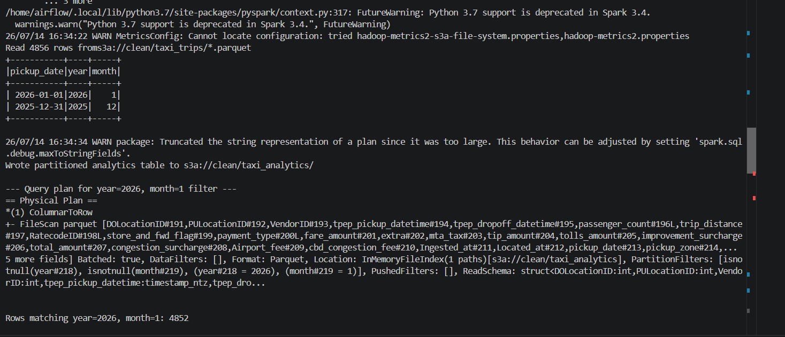

# NYC Taxi Batch Pipeline

An end-to-end batch data pipeline that ingests raw NYC Taxi trip data, cleans and enriches it, validates data quality, and produces a partitioned analytics table — all orchestrated by Apache Airflow and running on Dockerized infrastructure with PySpark and MinIO (S3-compatible object storage).

This project follows a medallion-style architecture (raw → clean → analytics) and was built as a hands-on way to learn the core data engineering toolchain: Airflow, Spark, and cloud-style object storage, all running locally.

---

## Architecture

```
NYC TLC Trip Data (.parquet)
        |
        v
[raw_ingest.py]  --- adds ingestion_timestamp, source_file metadata
        |
        v
  MinIO: raw/taxi_ingest/
        |
        v
[transform.py]  --- dedup, type casting, filtering, zone lookup join, daily aggregation
        |
        v
  MinIO: clean/taxi_trips/  +  clean/taxi_daily_summary/
        |
        v
[validate.py]  --- data quality gate: null checks, row count bounds, future-date check
        |
        v
[final_analytics.py]  --- adds year/month, writes partitioned output
        |
        v
  MinIO: clean/taxi_analytics/year=YYYY/month=M/

All four steps are orchestrated as a single Airflow DAG:
raw_ingest >> transform >> validate >> final_analytics
```

---

## Tech Stack

| Component            | Tool                                   |
|-----------------------|-----------------------------------------|
| Orchestration          | Apache Airflow 2.3.1 (CeleryExecutor)  |
| Processing             | PySpark 3.4.4                          |
| Object Storage          | MinIO (S3-compatible, local)          |
| Containerization        | Docker Compose                        |
| Data Quality            | Custom PySpark validation checks (see *Design Decisions*) |
| Language                | Python 3.7                             |

---

## Data Source

NYC TLC Yellow Taxi Trip Records (Parquet format)
Source: [NYC TLC Trip Record Data](https://www.nyc.gov/site/tlc/about/tlc-trip-record-data.page)

Also uses the NYC Taxi Zone Lookup table (`NYC_taxi_Zones.csv`) to map pickup/dropoff location IDs to borough and zone names.

---

## How to Run Locally

### Prerequisites
- Docker Desktop installed and running
- At least 4GB of memory allocated to Docker (see *Design Decisions* below for notes on running with less)

### Setup

1. Clone this repo and `cd` into it.

2. Create a `.env` file in the project root:
   ```
   AIRFLOW_IMAGE_NAME=apache/airflow:2.3.1
   AIRFLOW_UID=50000
   _PIP_ADDITIONAL_REQUIREMENTS=
   ```
   (PySpark is installed at image build time via the custom `Dockerfile`, not via this variable — see below.)

3. Folder structure:
   ```
   project-1/
   ├── docker-compose.yaml
   ├── Dockerfile
   ├── .env
   ├── dags/
   │   └── batch_pipeline_dag.py
   ├── scripts/
   │   ├── raw_ingest.py
   │   ├── transform.py
   │   ├── validate.py
   │   ├── final_analytics.py
   │   ├── NYC_Taxi_Zones.csv
   │   └── yellow_tripdata_2026-01.parquet   (place your downloaded trip data here)
   ├── logs/
   └── plugins/
   ```

4. Build the custom image (includes Java + PySpark + S3 JARs):
   ```bash
   docker compose build
   ```

5. Start everything:
   ```bash
   docker compose up -d
   ```

6. Create two buckets in MinIO (`localhost:9001`, login `minioadmin`/`minioadmin`):
   - `raw`
   - `clean`

7. Open Airflow at `localhost:8080` (login `airflow`/`airflow`), unpause the `batch_pipeline` DAG, and trigger a run.

---

## Pipeline Stages

### 1. Raw Ingestion (`raw_ingest.py`)
Reads raw NYC Taxi `.parquet` files, tags each row with `Ingested_at` (timestamp) and `Located_at` (source file path), and appends the result to `s3a://raw/taxi_ingest/`. Uses append mode intentionally — the raw zone is an audit trail and should never lose history.

### 2. Transformation (`transform.py`)
- Deduplicates rows using a composite key (no single trip ID exists in the source data)
- Casts numeric fields to proper types
- Filters out rows with non-positive fare, total, or distance (likely data errors / cancellations)
- Joins against the taxi zone lookup table twice (once for pickup, once for dropoff)
- Computes a daily summary (revenue, trip count, avg distance) grouped by borough and date
- Writes both the cleaned trip-level table and the daily summary to `s3a://clean/`

### 3. Data Quality Validation (`validate.py`)
Runs three checks against the cleaned data and fails the pipeline (non-zero exit code) if any fail:
- No nulls in key columns (IDs, timestamps, amounts)
- Row count within an expected range (catches silent empty-file or duplicate-ingestion bugs)
- No pickup dates in the future

### 4. Final Analytics Table (`final_analytics.py`)
Adds `year` and `month` columns and writes the cleaned data partitioned by both, producing a folder structure like `taxi_analytics/year=2026/month=1/`. Verified partition pruning works by filtering a test query to a single year/month and confirming `PartitionFilters` appears in the Spark physical query plan — meaning Spark skips irrelevant partition folders entirely rather than reading everything and filtering afterward.

---

## Design Decisions & Tradeoffs

**Sampled data volume.** Development was done on an 8GB RAM machine with ~3.5GB available to Docker. Processing the full multi-month dataset caused the Spark JVM to be OOM-killed during write operations (confirmed via `docker inspect --format='{{.State.OOMKilled}}'`). Rather than fight this indefinitely, the pipeline intentionally samples the ingested data (`.limit(5000)`) to a size that fits comfortably in available memory. In a production environment with a real cluster (or more local RAM), this limit would be removed. This tradeoff — and the process of diagnosing it via `docker stats` and OOM inspection rather than guessing — is itself a realistic data engineering debugging story.

**Manual data quality checks instead of Great Expectations.** Great Expectations is a heavier dependency that would have added further memory and install-time overhead. Instead, `validate.py` implements the same category of checks (null checks, row count bounds, freshness checks) directly in PySpark, exiting with a non-zero code to fail the Airflow task on any check failure. This achieves the same pipeline behavior — a data quality gate that blocks bad data from propagating — with a lighter footprint. Adding real Great Expectations is a natural next step if running on a machine with more resources.

**Custom Dockerfile instead of `_PIP_ADDITIONAL_REQUIREMENTS`.** Initially used Airflow's `_PIP_ADDITIONAL_REQUIREMENTS` environment variable to install PySpark, but this reinstalls the ~300MB package from scratch on every single container restart. Switched to baking PySpark, Java (OpenJDK 11), and the Hadoop AWS / AWS SDK JARs (needed for `s3a://` connectivity to MinIO) directly into a custom Dockerfile, so they're installed once at build time.

**PySpark version pinned to 3.4.4, not the latest.** The base `apache/airflow:2.3.1` image runs Python 3.7, and PySpark 3.5+ requires Python 3.8+. 3.4.4 is the newest version compatible with this Python version.

**Stopping non-essential containers during local script testing.** With ~3.5GB total memory shared across 7 containers (Postgres, Redis, Airflow webserver/scheduler/worker/triggerer, MinIO), running Spark jobs manually via `docker compose exec` sometimes competed with idle services for memory. Stopping `airflow-webserver`, `airflow-scheduler`, and `airflow-triggerer` during manual script development freed enough headroom to run reliably.

---

## What I'd Do Differently With More Resources

- Remove the `.limit()` sampling and process full multi-month datasets
- Swap manual validation for a real Great Expectations suite
- Add retry/backoff and alerting (email on failure) to the DAG
- Partition the raw zone as well, not just the final analytics table
- Move from local-mode Spark to a real multi-node setup (e.g. a small EMR or Databricks cluster) to see how partition counts and shuffle behavior change at actual scale

---

## Screenshots

### Airflow DAG — all 4 tasks succeeding


### MinIO bucket structure


### Partition pruning proof (Spark query plan)
